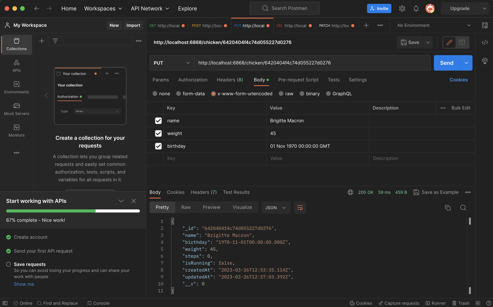

<!-- L’objectif de ce challenge est de créer une API en Javascript (NodeJS)
Le webservice /chicken sera un CRUD avec les méthodes suivantes : GET /
POST / PUT / PATCH / DELETE

L’objet chicken est tel que :
name: String (required),
birthday: Date,
weight: Number (required),
steps: Number (default 0),
isRunning: Boolean (default false) Puis le webservice /chicken/run
augmentera la variable steps de 1.

Libre à toi d’utiliser la base de données et les frameworks de votre
choix.

Une documentation détaillée serait un plus !

BONUS : Ajouter un lien de chicken vers un autre objet comme farmyard ou
coop. -->

# Getting Started with create API NodeJS

## Server

This project works width `v19.8.1` node version and `9.5.1` npm version

* Install node: ```npm i```
* Check node version: ```node -v```
* Check npm version: ```npm -v```
* create server: ```npm init -y```
* install dependencies: ```npm i express dotenv mongoose nodemon```
* start server: ```npm run server```

## Create requests

You can download [Postman](https://www.postman.com/downloads/) to test your `GET`, `POST`, `PUT`, `DELETE`, `PATCH` methods when you don't have a frontend.



## DataBase

Create a cluster with [MongoDB Atlas](https://www.mongodb.com/cloud/atlas/register) and add your URI database in a `.env` file.

```
MONGO_URI=mongodb+srv://{user}:{password}@{your-app-name}.amppegj.mongodb.net/{db-name}
```

You can download the Desktop App [MongoBD Compas](https://www.mongodb.com/products/compass)
